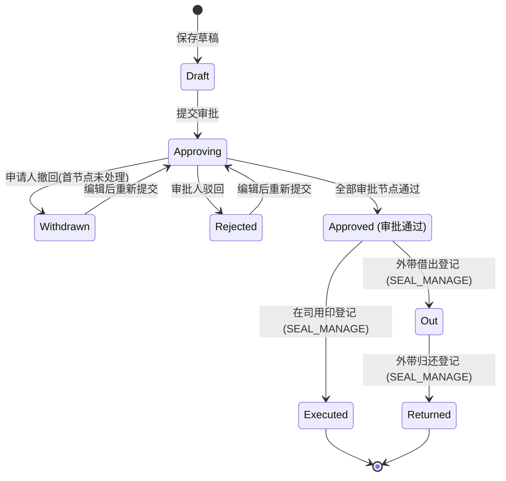

# 用章申请模块 PRD

## 1. 产品目标

用章申请用于员工在因对外签署合同、出具公函、资质证明、投标、财务往来或人事办理等业务需要使用企业法定印章时提交审批申请。通过明确用印事由、文件类别、用印份数、印章类型以及是否外带借出，实现分级审批控制；审批通过后由具备印章管理权限的专职人员（行政/印章管理员）执行用印登记（及上传盖章后归档件），若为外带借出则记录借出并在使用完毕后完成归还登记，形成“申请—审批—用印/借出—归还/归档”的全流程合规闭环与安全追溯。

V1.0 面向中小企业通用印章管理，覆盖 Web 响应式界面。暂不实现电子印章与第三方 CA 电子签名、物理智能印章机物联网联动、OCR 骑缝章自动核验；这些能力后续通过电子签与智能硬件模块扩展。

## 2. 角色与权限

| 角色 | 能力 |
|---|---|
| 员工 | 创建、编辑、提交、撤回和查看本人用章申请；外带时负责印章保管 |
| 部门负责人 | 按待办审批直属下级用章申请；按数据范围查看部门用章单据 |
| 行政主管/经理 | 对涉及重要文件、多份用印或外带借出进行行政合规审批 |
| 总经理 | 对涉及外带借出或法人章用印进行最终决策审批 |
| 印章管理员（行政专员/主管） | 按数据范围查看用章单据；对已批准申请执行在司用印登记或外借出库登记；对外带印章执行归还核验登记 |
| 系统管理员 | 全公司查看、印章管理执行、流程与权限配置 |

新增权限：

- `SEAL_SCOPE_VIEW`：按角色数据范围查看他人用章申请；
- `SEAL_MANAGE`：执行用印登记、外借出库与归还登记。

用章数据范围与请假、报销、出差、采购一致，支持仅本人（`SELF`）、本部门（`DEPARTMENT`）、本部门及下级部门（`DEPARTMENT_AND_CHILDREN`）、全公司（`COMPANY`）。申请人、当前审批人和抄送人不受普通列表数据范围限制，可查看与自己直接相关的单据。

## 3. 页面范围

### 3.1 用章申请列表 `/seal`

- 默认按创建时间倒序，服务端分页；
- 筛选：关键字（单号、主题、文件名称、经办人）、状态、印章类型、申请人、用印日期范围；
- 列：申请单号、申请人、用印主题、文件类别与名称、印章类型、份数、是否外带、状态、创建时间、操作；
- 支持发起用章申请和进入详情。

### 3.2 新建/编辑用章申请

基础字段：
- 用印主题（必填，1–100 字符）；
- 文件类别（必填，下拉单选：合同协议、公文函件、资质证明、投标材料、财务凭证、人事证明、其他）；
- 文件名称（必填，1–100 字符）；
- 印章类型（必填，下拉单选：公章、合同专用章、财务专用章、法人章、人事专用章、其他）；
- 用印份数（必填，整数，1–100 份）；
- 是否外带（必填，单选或开关：否 [在司用印] / 是 [外带借出]）；
- 外带借出参数（当是否外带为“是”时必填）：
  - 预计借出日期（必填，不得早于申请当日）；
  - 预计归还日期（必填，必须 >= 借出日期，且借用周期最长不超过 30 个自然日）；
  - 借出保管人（必填，1–50 字符，默认申请人姓名）；
- 申请事由（必填，1–500 字符）；
- 待盖章文件原件/附件（可选，0–20 个已上传文件）；
- 抄送人（可选，同租户 ACTIVE 员工）。

### 3.3 用章申请详情 `/seal/:id`

- 展示用印基础信息、外带参数、待盖章附件下载、抄送人；
- 当前审批实例与只追加审批操作轨迹（FlowInstanceTimeline）；
- 操作动作：
  - 申请人未审批时可“撤回申请”；
  - 审批中驳回可“编辑重提”或“删除草稿”；
  - 审批通过后（`Approved`），具备 `SEAL_MANAGE` 权限的用户可见“登记用印”或“登记借出”按钮；
  - 外带借出后（`Out`），具备 `SEAL_MANAGE` 权限的用户可见“登记归还”按钮。

### 3.4 登记用印/借出弹窗

- 仅在单据处于 `Approved` 状态且操作人具备 `SEAL_MANAGE` 权限时可用；
- 若为在司用印：
  - 实际用印日期（必填，不得早于申请创建日期，不得晚于当天）；
  - 经办盖章人（必填，1–50 字符，默认当前登录人姓名）；
  - 用印完成说明（选填，最大 500 字符）；
  - 盖章后扫描归档件附件（可选，0–20 个文件）。
  - 保存后状态流转至 `Executed`（已用印）。
- 若为外带借出：
  - 实际借出日期（必填，不得早于申请创建日期，不得晚于当天）；
  - 移交经办人（必填，1–50 字符，默认当前登录人姓名）；
  - 借出交接说明（选填，最大 500 字符）；
  - 借出交接单/凭据附件（可选，0–20 个文件）。
  - 保存后状态流转至 `Out`（借出中）。

### 3.5 登记归还弹窗

- 仅在单据处于 `Out` 状态且操作人具备 `SEAL_MANAGE` 权限时可用；
- 实际归还日期（必填，不得早于实际借出日期，不得晚于当天）；
- 印章核验状态（必填：`INTACT` 完好 / `DAMAGED` 损坏 / `LOST` 异常遗失）；
- 归还接收人（必填，1–50 字符，默认当前登录人姓名）；
- 盖章后文件归档附件（可选，0–20 个文件）；
- 归还验收说明（选填，最大 500 字符）；
- 保存后状态流转至 `Returned`（已归还）。

## 4. 业务规则

1. **印章类型字典**：
   - 公章 (`OFFICIAL_SEAL`)
   - 合同专用章 (`CONTRACT_SEAL`)
   - 财务专用章 (`FINANCE_SEAL`)
   - 法人章 (`LEGAL_PERSON_SEAL`)
   - 人事专用章 (`HR_SEAL`)
   - 其他 (`OTHER`)
2. **文件类别字典**：
   - 合同协议 (`CONTRACT`)
   - 投标材料 (`BIDDING`)
   - 公文函件 (`OFFICIAL_DOC`)
   - 资质证明 (`CREDENTIAL`)
   - 财务凭证 (`FINANCIAL_DOC`)
   - 人事证明 (`HR_DOC`)
   - 其他 (`OTHER`)
3. **分级审批路由规则（`SEAL_DEFAULT` 预置流程）**：
   - 规则一（普通低风险在司用印）：
     - 条件：`IsOut == false` 且 `Copies <= 3` 且文件类别不为合同协议、投标材料，且印章不为法人章；
     - 审批节点：`DIRECT_MANAGER`（直属上级 1 级审批）。
   - 规则二（重要文件或多份用印）：
     - 条件：`IsOut == false` 且（`Copies > 3` 或文件类别为合同协议、投标材料）且印章不为法人章；
     - 审批节点：`DIRECT_MANAGER` → `ROLE:行政/人事`（两级审批）。
   - 规则三（高风险：外带借出或法人章用印）：
     - 条件：`IsOut == true` 或 印章为法人章；
     - 审批节点：`DIRECT_MANAGER` → `ROLE:行政/人事` → `ROLE:总经理`（三级审批）。
4. **并发与幂等**：
   - 单据保存、提交、审批、撤回、用印登记与归还登记均携带单据 `Version` 字段，执行乐观锁校验；
   - 关键写操作由 `IdempotencyService` 基于客户端请求指纹与分布式幂等锁保证不可重复执行。
5. **安全与审计**：
   - 附件须通过 `FileService` 校验当前登录用户所有权与白名单病毒扫描；
   - 记录 `SEAL_SUBMITTED`、`SEAL_APPROVED`、`SEAL_REJECTED`、`SEAL_WITHDRAWN`、`SEAL_EXECUTED`、`SEAL_OUT`、`SEAL_RETURNED` 审计日志。

## 5. 状态流转机

## 6. 错误码约定

| 错误码 | 描述 |
|---|---|
| `SEAL_001` | 用印基础字段不合法（主题、文件类别、文件名称、印章类型或份数不合法） |
| `SEAL_002` | 外带参数不合法（借出日期不能早于申请日，归还日期不能早于借出日且周期不能超过 30 天，借用保管人不能为空） |
| `SEAL_003` | 用印/借出登记失败（状态非 Approved、实际用印日期晚于当天或早于申请日、经办人为空） |
| `SEAL_004` | 归还登记失败（状态非 Out、归还日期早于借出日或晚于当天、核验状态不合法） |
| `AUTH_002` | 无权限操作（缺乏 `SEAL_MANAGE` 登记权限或缺乏数据查看权限） |
| `FILE_005` | 附件不存在、不属于当前用户或超过限制 |
| `CONCURRENCY_001` | 单据已被其他用户修改，版本冲突 |

## 7. 验收测试标准

1. 1 份普通公文在司用印申请，正确路由至直属上级单级审批通过，登记用印后状态变为 `Executed`；
2. 5 份合同协议在司用印申请，正确路由至直属上级与行政人员两级审批通过；
3. 外带公章借出申请，正确路由至直属上级、行政人员、总经理三级审批；
4. 外带借出参数中归还日期早于借出日期或超过 30 天时提交被拦截（`SEAL_002`）；
5. 已有审批记录的单据禁止撤回；未处理前申请人可撤回；
6. 审批通过后，非 `SEAL_MANAGE` 权限人员登记用印被拒绝（`AUTH_002`）；
7. 外带单据登记借出后流转为 `Out`，登记归还核验后流转为 `Returned`；
8. 跨 DbContext / 重启后用章单据、外带参数、审批轨迹、用印登记与归还记录完整持久化；
9. 全程审计日志均可按 `SealRequest` 追溯查询。
