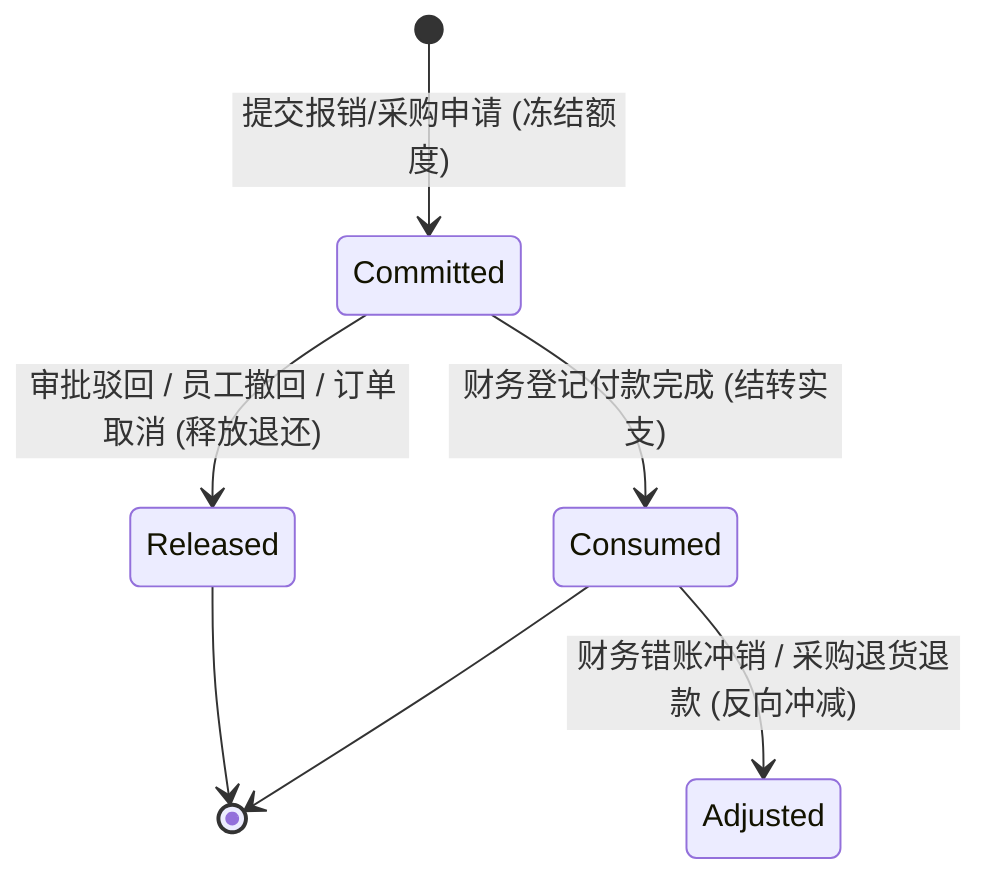
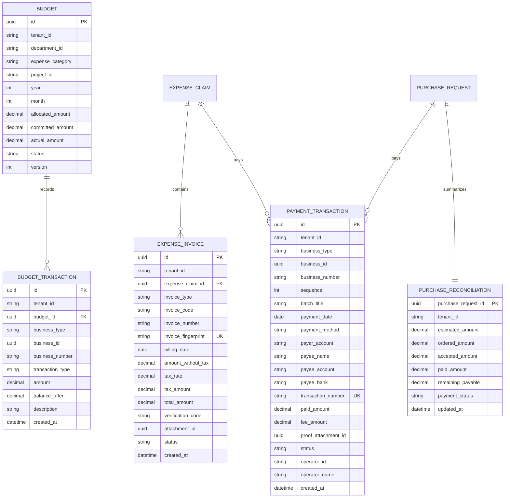

# 费用预算与采购付款闭环 PRD

## 1. 文档定位与业务背景

### 1.1 背景与现状痛点
在 OA 系统现行版本中，员工日常请假、差旅出差、费用报销以及物资采购已完成了从前端表单、多级条件审批流（SLA/试算/代理/抄送）、业务参数中心动态配置到统一事项中心的闭环落地。但在财务运营与成本风控层面，仍存在以下关键业务痛点与管理风险：

1. **发票合规与重复报销（一票多报）风险**：
   - 现有报销明细仅支持弱校验的单据文本发票号或单一附件，未结构化采集发票代码、发票号码、开票日期、税额、价税合计等关键要素。
   - 缺乏全系统维度的强防重校验机制，难以防范同一张电子发票被同一员工跨期重复提交，或被不同员工在不同报销单中重复报销。
2. **预算管理脱节，事后超支无法挽回**：
   - 现有审批流仅有“超预算”软性布尔标记，缺乏事前预算额度编制、事中提交申请时自动预占（Commitment）、审批不通过或撤回时自动释放（Release）、真实付款后结转扣减（Actual Consumption）的动态控制机制。
   - 各业务部门与项目缺乏月度/年度预算水位实时监控，常在财务期末核算时才发现预算严重超支。
3. **采购申请与资金支付脱节（四单无法对账）**：
   - 目前采购模块已具备“申请—审批—下单—验收”轨迹，但采购订单与财务实际支出完全分离。
   - 财务无法在系统中比对“采购申请预估金额、采购合同下单金额、验收入库实物金额、累计财务实付金额”（采购四单），存在供应商未如约交货却已全额付款的资金安全隐患。
4. **单笔单据一次性付款模式与企业真实分期支付脱节**：
   - 现有单据模型仅假定一次性付清（1-to-1），无法支持大额采购或工程服务中常见的“预付款（首付 30%）→ 发货款（50%）→ 质保尾款（20%）”分笔付款模式。
5. **财务对账、报表统计与审计追踪闭环缺失**：
   - 财务专员与财务经理无法根据部门、科目、发票合规状态和付款状态进行多维度台账查询与受控安全导出。

### 1.2 本期目标与建设范围
本期（**Iteration 4: P1-F4**）聚焦打通企业资金支出与成本控制的“任督二脉”，实现如下核心目标：
- **发票防重与结构化台账**：支持结构化采集增值税专票/普票/电子票/行程单等发票要素，建立发票指纹索引，实现跨单据、跨员工秒级强防重阻断。
- **部门与科目多维预算管控体系**：支持按“部门 + 费用科目 + 年度/月度”编制预算额度；申请提交实时预占，驳回/撤回自动全额退还，付款结转为实际支出；提供超预算“严格阻断”或“高管特批加签”两种可选策略。
- **采购四单对账看板**：在采购单据详情中自动汇总展示“申请预估额 vs 下单合同额 vs 验收入库额 vs 累计付款额”，直观计算差异率与待付资金敞口。
- **多笔分期付款流水账（Payment Transactions）**：扩展单笔付款为多次交易流水，支持状态机（`待付款 PENDING` → `部分付款 PARTIALLY_PAID` → `已付清 PAID`），记录付款银行、交易流水号、回单凭据与操作经办人。
- **财务受控导出与合规审计**：对报销、采购、发票及付款流水提供包含操作审计的数据导出机制，严格防范财务敏感信息泄露。

---

## 2. 角色与数据权限体系

### 2.1 涉及角色与职责划分
| 角色名称 | 权限编码 / 角色代码 | 核心业务职责与操作能力 |
|---|---|---|
| **普通员工** | `员工` | 提交报销或采购时选择费用归属部门/科目，录入结构化发票并查看当前预算占用提示；查看本人单据付款进度与分期流水明细。 |
| **部门负责人** | `部门负责人` | 审批职责范围内报销与采购；查看本部门当前年度/月度预算剩余水位与超预算告警；监控团队采购四单执行进度。 |
| **财务专员** | `EXPENSE_PAY`<br>`PURCHASE_MANAGE` | 审核发票合规性与票面信息；在审批通过后对报销单或采购订单执行单笔或多次“登记付款”；上传银行转账回单凭证；发起作废重付。 |
| **财务经理** | `EXPENSE_ALL_VIEW`<br>`EXPENSE_PAY`<br>`BUSINESS_CONFIG_MANAGE` | 编制并发布各部门年度/月度预算额度；对超预算申请执行特批审批；查看并导出全公司发票对账表、预算执行看板与付款流水对账单。 |
| **总经理** | `总经理` | 高额度采购/报销终审；审批年度总预算编制及重大预算调增申请。 |
| **系统管理员** | `系统管理员` | 系统字典维护、基础权限配置、审计日志排查。 |

### 2.2 敏感数据保护与数据范围隔离
1. **银行卡号脱敏显示**：员工报销收款银行卡号在列表和一般展示界面中默认仅显示后 4 位（如 `**** **** **** 8821`），仅对具备 `EXPENSE_PAY` 权限的财务人员在付款登记界面提供明文查验，所有敏感卡号查看操作记录审计日志。
2. **数据范围隔离**：
   - 部门负责人仅能查询本管理链范围内的预算占用流水与付款状态；
   - 财务人员基于其 `Expense` / `Purchase` 数据范围（全公司或特定部门）查看报销发票明细与付款订单，严禁将财务权限旁路渗透至人事档案或敏感劳动合同。

---

## 3. 核心功能与业务规则设计

### 3.1 报销发票信息采集与全系统防重

#### 3.1.1 发票要素结构化采集
在报销单明细（`ExpenseItem`）中，引入关联发票实体。一张报销单可关联多张发票，单笔费用明细亦可对应单张或多张发票。发票录入支持以下核心要素：
- **发票类型 (`InvoiceType`)**：
  - `VAT_SPECIAL`：增值税专用发票
  - `VAT_NORMAL`：增值税普通发票
  - `VAT_ELECTRONIC`：增值税电子普通发票（含数电票/全电发票）
  - `TRAIN_TICKET`：铁路车票
  - `AIR_ITINERARY`：航空运输电子客票行程单
  - `QUOTA_INVOICE`：定额发票 / 通用机打发票
  - `OTHER_RECEIPT`：其他合规收据凭据
- **发票代码 (`InvoiceCode`)**：10–12 位字符（数电票可为空）。
- **发票号码 (`InvoiceNumber`)**：8–20 位字符，必填。
- **开票日期 (`BillingDate`)**：标准日期，不得晚于提交报销当天，且不得早于报销当天前 180 天（期限可由参数配置中心动态下发）。
- **金额要素**：
  - 不含税金额 (`AmountWithoutTax`)：数值，两位小数，`>= 0`；
  - 税率 (`TaxRate`)：百分比，如 `6%`, `9%`, `13%`, `0%`；
  - 税额 (`TaxAmount`)：数值，两位小数，`>= 0`；
  - 价税合计总额 (`TotalAmount`)：数值，必填，`TotalAmount = AmountWithoutTax + TaxAmount`。
- **发票查验码 / 校验码 (`VerificationCode`)**：后 6 位，选填。
- **发票原件影像件 (`AttachmentId`)**：上传的 PDF 或合规图片附件，必须通过隔离存储与 ClamAV 恶意扫描。

#### 3.1.2 发票全系统强防重机制
1. **发票唯一指纹算法**：
   针对标准增值税发票与数电发票，系统计算标准化发票唯一指纹：
   $$\text{InvoiceFingerprint} = \text{SHA-256}(\text{TenantId} + \text{"\_"} + \text{InvoiceCode.Trim()} + \text{"\_"} + \text{InvoiceNumber.Trim()})$$
2. **防重触发时机与动作**：
   - **保存草稿与提交申请时**：系统在事务内查询当前租户下所有处于 `DRAFT`（其他单据）、`SUBMITTED`、`APPROVING`、`APPROVED`、`PAID` 状态的发票记录。
   - **防重冲突阻断**：若发现相同指纹的发票已存在且所属报销单未被驳回/撤回，直接拒绝提交，并返回精确错误提示：
     > `INVOICE_DUPLICATE: 发票号码 [10293847] 已在报销申请 [EXP-20260901-0002]（报销人：李薇，状态：审批中）中提交，禁止重复报销。`
   - **单据撤回与驳回释放**：当报销单被审批驳回或由申请人主动撤回时，单据内发票状态转为 `RELEASED`，指纹释放，允许员工修正后重新提交。

---

### 3.2 多维预算体系（部门 / 费用科目 / 项目）与动态占用闭环

#### 3.2.1 预算池维度与额度编制
支持财务经理按如下维度编制企业预算（`Budget`）：
- **维度定义**：`租户 (TenantId) + 预算周期 (年度 Year / 月度 Month) + 归属部门 (DepartmentId) + 费用科目 (ExpenseCategory，可选) + 归属项目 (ProjectId，可选)`。
- **预算生命周期状态机**：
  - `DRAFT`（编制中）：财务专员录入期初预算金额，尚未生效；
  - `ACTIVE`（执行中）：已发布生效，业务单据可进行额度占用与核销；
  - `FROZEN`（已冻结）：因审计或经营调整暂停占用，仅允许查询或结转；
  - `CLOSED`（已封账/归档）：周期结束归档，剩余未用额度按财务政策清零或结转至下期。

#### 3.2.2 预算额度核算模型
每个生效的预算池维护四个动态额度数值（均保留 2 位小数）：
1. **编制预算总额 (`AllocatedAmount`)**：期初核定额度 + 批准的预算追加额；
2. **在途预占金额 (`CommittedAmount`)**：处于审批中、已通过待付款、已下单未付款的业务单据金额；
3. **实际执行金额 (`ActualAmount`)**：财务已完成付款登记确认出账的累计金额；
4. **实时可用额度 (`AvailableAmount`)**：
   $$\text{AvailableAmount} = \text{AllocatedAmount} - \text{CommittedAmount} - \text{ActualAmount}$$

#### 3.2.3 业务流与预算交互流水状态机
系统对每次预算变动严格记录不可篡改的不可逆流水账（`BudgetTransaction`）：


1. **预占额度 (`RESERVED`)**：
   - 员工提交报销单或采购申请时，系统根据费用所属部门、费用类别及金额，原子检查当前可用预算：
     - 若 $\text{ApplyAmount} \le \text{AvailableAmount}$：生成 `RESERVED` 流水，$\text{CommittedAmount} \leftarrow \text{CommittedAmount} + \text{ApplyAmount}$；
     - 若 $\text{ApplyAmount} > \text{AvailableAmount}$（超预算）：
       - 根据业务参数配置中心中 `ExpensePolicy` 的 `blockWhenExceeded` 设定：
         - 若配置为 `true`：系统抛出 `BUDGET_EXCEEDED` 严格阻断提交；
         - 若配置为 `false`：允许强行提交，单据打上 `[超预算]` 预警徽标，流程引擎自动在审批链路中加签财务经理/财务总监特批节点。
2. **释放额度 (`RELEASED`)**：
   - 单据在审批中被驳回、由申请人主动撤回、采购单被取消时，系统生成 `RELEASED` 流水，原子返还：
     $$\text{CommittedAmount} \leftarrow \text{CommittedAmount} - \text{ApplyAmount}$$
     $$\text{AvailableAmount} \leftarrow \text{AvailableAmount} + \text{ApplyAmount}$$
3. **结转实支 (`CONSUMED`)**：
   - 财务对已批准单据登记付款完成时，系统生成 `CONSUMED` 结转流水：
     $$\text{CommittedAmount} \leftarrow \text{CommittedAmount} - \text{PaidAmount}$$
     $$\text{ActualAmount} \leftarrow \text{ActualAmount} + \text{PaidAmount}$$
4. **并发控制与死锁防护**：
   - 预算扣减采用 PostgreSQL 行级排他锁（`SELECT ... FOR UPDATE`）配合 `ConcurrencyVersion` 乐观锁双重保护，确保多名员工同时提交跨部门/同科目报销时，预算不会出现透支超扣。

---

### 3.3 采购申请到付款四单对账闭环

为解决采购执行与财务支付脱节问题，建立“采购四单对账机制”：
```
[1. 采购申请]              [2. 采购订单]              [3. 到货验收]              [4. 财务付款]
 预估总额：￥50,000  ───>   下单合同额：￥48,500 ───>   验收实收额：￥48,500 ───>   累计实付额：￥48,500
 (分级审批与预算预占)      (登记合同/供应商/交期)      (质检验收/合格入库)         (分期打款/银行回单)
```

#### 3.3.1 四单指标与差异率核算
采购详情页提供“四单对账执行看板”：
| 对账指标 | 对应业务实体与字段 | 业务含义与风控门槛 |
|---|---|---|
| **申请预估额** | `PurchaseRequest.EstimatedTotal` | 业务部门发起时审批的计划上限支出。 |
| **下单合同额** | `PurchaseRequest.OrderAmount` | 采购专员登记的实际采购合同/协议总额。若 $\text{下单额} > \text{申请额}$，提示超额比率，超 5% 须追加审批。 |
| **到货验收额** | `PurchaseRequest.AcceptedAmount` | 到货检验合格入库的实物等值金额。未验收或验收不合格标记风险。 |
| **累计付款额** | $\sum \text{PaymentTransaction.PaidAmount}$ | 财务专员实际向供应商银行打款的累计支出金额。 |
| **待付敞口** | $\text{下单合同额} - \text{累计付款额}$ | 企业当前对该笔采购尚未结清的应付账款敞口。 |

#### 3.3.2 资金支付风控门槛
1. **未下单严禁付款**：采购申请状态必须处于 `ORDERED`（已下单）或 `ACCEPTED`（已验收）状态才允许财务进入付款流程。
2. **到货验收前限额付款（预付款比例保护）**：
   - 若采购单处于“已下单、尚未验收”阶段，允许财务支付首批“预付款/定金”；
   - 预付款累计金额占下单总额的比例不得超过系统参数配置的最高比例（默认 50%）。超过此限额时，必须待到货验收记录登记为“合格”后方可解冻后续尾款支付。
3. **超额支付绝对阻断**：
   - 累计付款金额严格不得超过下单合同金额（$\sum \text{PaidAmount} \le \text{OrderAmount}$），杜绝财务误操作重复支付。

---

### 3.4 多笔分期付款流水账（Payment Transactions）

#### 3.4.1 单据付款状态机
单据（报销单 `ExpenseClaim` / 采购申请 `PurchaseRequest`）的付款生命周期由单一状态升级为多阶段状态机：
- `UNPAID`（待付款）：审批通过后的初始状态，尚未产生任何付款记录；
- `PARTIALLY_PAID`（部分付款）：存在至少 1 笔成功的付款流水，但 $\sum \text{PaidAmount} < \text{TotalPayableAmount}$；
- `PAID`（已付清）：累计实付金额达到或等于单据应付总额；
- `PAYMENT_CANCELLED`（付款终止）：因单据作废、退货或不可抗力终止后续付款。

#### 3.4.2 付款交易流水要素 (`PaymentTransaction`)
每笔付款操作均生成独立的交易凭据流水：
- **交易流水号 (`TransactionNumber`)**：财务人员录入的银行转账汇款单号，或银企对接自动返回的交易序号，同租户下全局唯一；
- **付款批次 (`BatchNo`)**：如 `第 1 笔 (预付款)`、`第 2 笔 (到货尾款)`；
- **付款时间 (`PaymentDate`)**：真实转账打款日期时间；
- **结算方式 (`PaymentMethod`)**：`BANK_TRANSFER` (银行转账)、`CORPORATE_ALIPAY` (企业支付宝)、`CORPORATE_WECHAT` (企业微信支付)、`CHEQUE` (支票)、`CASH` (现金)；
- **付款账户 (`PayerAccount`)**：出资的企业对公银行账户（如“招商银行深圳高新支行 7559...”）；
- **收款账户信息**：收款人名称、开户银行、银行账号（从报销单或采购供应商台账中带出，支持财务根据真实回执核对）；
- **本次实付金额 (`PaidAmount`)**：本笔流水打款金额，必须 `> 0`；
- **交易手续费 (`FeeAmount`)**：转账手续费（如有），不占单据核销额度，计入财务费用；
- **付款凭证附件 (`ProofAttachmentId`)**：上传的银行电子回单原件（PDF/图片），支持财务下载与外部审计抽检；
- **经办操作人 (`OperatorId`, `OperatorName`)**：执行打款登记的财务人员信息及操作时间戳。

---

### 3.5 财务数据导出与安全对账

1. **导出范围与维度**：
   - **报销明细与发票对账导出**：包含报销单号、报销人、部门、费用类别、报销金额、发票代码、发票号码、开票日期、税额、价税合计、付款状态；
   - **预算执行明细导出**：包含部门、科目、周期、编制预算、已预占金额、已消耗金额、可用余额、执行率；
   - **采购四单对账汇总导出**：包含采购编号、申请人、部门、申请预估额、下单额、验收额、累计实付额、待付敞口。
2. **安全审计追踪**：
   - 导出操作强制受 `EXPENSE_PAY` / `PURCHASE_MANAGE` 权限保护；
   - 每次导出在 `audit_log` 中记录审计事件 `FINANCE_EXPORT`，记录导出人、导出筛选条件、导出数据总行数及客户端 IP。

---

## 4. 数据模型与持久化设计（PostgreSQL）



### 4.1 数据表定义

#### 1. `budget`（企业与部门预算池表）
```sql
CREATE TABLE budget (
    id UUID PRIMARY KEY DEFAULT gen_random_uuid(),
    tenant_id VARCHAR(64) NOT NULL DEFAULT 'demo',
    department_id VARCHAR(64) NOT NULL,
    expense_category VARCHAR(64) NULL, -- 为空表示部门年度总预算，非空表示特定科目预算
    project_id VARCHAR(64) NULL,       -- 为空表示部门日常预算，非空表示项目专项预算
    year INT NOT NULL,
    month INT NOT NULL DEFAULT 0,      -- 0 表示整年，1-12 表示特定月度
    allocated_amount NUMERIC(14, 2) NOT NULL DEFAULT 0.00,
    committed_amount NUMERIC(14, 2) NOT NULL DEFAULT 0.00,
    actual_amount NUMERIC(14, 2) NOT NULL DEFAULT 0.00,
    status VARCHAR(32) NOT NULL DEFAULT 'ACTIVE', -- DRAFT, ACTIVE, FROZEN, CLOSED
    concurrency_version INT NOT NULL DEFAULT 1,
    created_by VARCHAR(64) NOT NULL,
    created_at TIMESTAMPTZ NOT NULL DEFAULT CURRENT_TIMESTAMP,
    updated_at TIMESTAMPTZ NOT NULL DEFAULT CURRENT_TIMESTAMP,
    CONSTRAINT uk_budget_dimension UNIQUE (tenant_id, department_id, COALESCE(expense_category, ''), COALESCE(project_id, ''), year, month)
);
CREATE INDEX ix_budget_lookup ON budget (tenant_id, department_id, year, month, status);
```

#### 2. `budget_transaction`（预算流水变动表）
```sql
CREATE TABLE budget_transaction (
    id UUID PRIMARY KEY DEFAULT gen_random_uuid(),
    tenant_id VARCHAR(64) NOT NULL DEFAULT 'demo',
    budget_id UUID NOT NULL REFERENCES budget(id) ON DELETE CASCADE,
    business_type VARCHAR(32) NOT NULL, -- Expense, Purchase, Travel
    business_id UUID NOT NULL,
    business_number VARCHAR(64) NOT NULL,
    transaction_type VARCHAR(32) NOT NULL, -- RESERVED (预占), RELEASED (释放), CONSUMED (结转实支), ADJUSTED (调整)
    amount NUMERIC(14, 2) NOT NULL,
    balance_after NUMERIC(14, 2) NOT NULL, -- 变动后可用余额快照
    description VARCHAR(500) NULL,
    operator_id VARCHAR(64) NOT NULL,
    created_at TIMESTAMPTZ NOT NULL DEFAULT CURRENT_TIMESTAMP
);
CREATE INDEX ix_budget_tx_budget ON budget_transaction (budget_id, created_at DESC);
CREATE INDEX ix_budget_tx_business ON budget_transaction (tenant_id, business_type, business_id);
```

#### 3. `expense_invoice`（报销发票明细台账）
```sql
CREATE TABLE expense_invoice (
    id UUID PRIMARY KEY DEFAULT gen_random_uuid(),
    tenant_id VARCHAR(64) NOT NULL DEFAULT 'demo',
    expense_claim_id UUID NOT NULL REFERENCES expense_claim(id) ON DELETE CASCADE,
    invoice_type VARCHAR(32) NOT NULL, -- VAT_SPECIAL, VAT_NORMAL, VAT_ELECTRONIC, TRAIN_TICKET, AIR_ITINERARY, QUOTA_INVOICE, OTHER_RECEIPT
    invoice_code VARCHAR(32) NOT NULL DEFAULT '',
    invoice_number VARCHAR(64) NOT NULL,
    invoice_fingerprint VARCHAR(128) NOT NULL, -- SHA256(tenant_id + code + number)
    billing_date DATE NOT NULL,
    amount_without_tax NUMERIC(14, 2) NOT NULL DEFAULT 0.00,
    tax_rate NUMERIC(6, 4) NOT NULL DEFAULT 0.00,
    tax_amount NUMERIC(14, 2) NOT NULL DEFAULT 0.00,
    total_amount NUMERIC(14, 2) NOT NULL,
    verification_code VARCHAR(32) NULL,
    attachment_id UUID NULL,
    status VARCHAR(32) NOT NULL DEFAULT 'COMMITTED', -- COMMITTED (正常报销中), PAID (已付款归档), CANCELLED (已释放/作废)
    created_at TIMESTAMPTZ NOT NULL DEFAULT CURRENT_TIMESTAMP,
    CONSTRAINT uk_invoice_fingerprint_active UNIQUE (tenant_id, invoice_fingerprint, status)
);
CREATE INDEX ix_invoice_claim ON expense_invoice (expense_claim_id);
CREATE INDEX ix_invoice_query ON expense_invoice (tenant_id, billing_date, invoice_type);
```

#### 4. `payment_transaction`（通用多笔付款流水表）
```sql
CREATE TABLE payment_transaction (
    id UUID PRIMARY KEY DEFAULT gen_random_uuid(),
    tenant_id VARCHAR(64) NOT NULL DEFAULT 'demo',
    business_type VARCHAR(32) NOT NULL, -- Expense, Purchase
    business_id UUID NOT NULL,
    business_number VARCHAR(64) NOT NULL,
    sequence INT NOT NULL DEFAULT 1,     -- 付款批次顺序号 (1, 2, 3...)
    batch_title VARCHAR(128) NOT NULL,  -- 如: 首笔预付款 (30%)、验收入库尾款
    payment_date DATE NOT NULL,
    payment_method VARCHAR(32) NOT NULL, -- BANK_TRANSFER, CORPORATE_ALIPAY, CORPORATE_WECHAT, CHEQUE, CASH
    payer_account VARCHAR(128) NOT NULL, -- 付款对公账号
    payee_name VARCHAR(128) NOT NULL,    -- 收款户名
    payee_account VARCHAR(128) NOT NULL, -- 收款账号
    payee_bank VARCHAR(128) NOT NULL,    -- 开户行
    transaction_number VARCHAR(128) NOT NULL, -- 银行汇款流水号
    paid_amount NUMERIC(14, 2) NOT NULL, -- 本次实付打款金额
    fee_amount NUMERIC(10, 2) NOT NULL DEFAULT 0.00, -- 手续费
    proof_attachment_id UUID NULL,       -- 银行电子回单原件
    remarks VARCHAR(500) NULL,
    status VARCHAR(32) NOT NULL DEFAULT 'SUCCESS', -- SUCCESS, FAILED
    operator_id VARCHAR(64) NOT NULL,
    operator_name VARCHAR(64) NOT NULL,
    created_at TIMESTAMPTZ NOT NULL DEFAULT CURRENT_TIMESTAMP,
    CONSTRAINT uk_payment_tx_number UNIQUE (tenant_id, transaction_number)
);
CREATE INDEX ix_payment_tx_business ON payment_transaction (tenant_id, business_type, business_id, sequence);
```

#### 5. 采购单表与报销单表扩展字段
- `expense_claim` 新增：
  - `payment_status VARCHAR(32) NOT NULL DEFAULT 'UNPAID'`：`UNPAID`, `PARTIALLY_PAID`, `PAID`
  - `paid_total_amount NUMERIC(14, 2) NOT NULL DEFAULT 0.00`：累计已付款总额
  - `invoice_count INT NOT NULL DEFAULT 0`：关联发票张数
- `purchase_request` 新增：
  - `payment_status VARCHAR(32) NOT NULL DEFAULT 'UNPAID'`：`UNPAID`, `PARTIALLY_PAID`, `PAID`
  - `paid_total_amount NUMERIC(14, 2) NOT NULL DEFAULT 0.00`：累计已付给供应商金额
  - `prepayment_limit_rate NUMERIC(6, 4) NOT NULL DEFAULT 0.50`：未验收前最高付款限额比例（默认 50%）

---

## 5. API 接口规格与参数契约

### 5.1 预算中心接口 (`/api/v1/budgets`)
| 方法 | 端点路径 | 权限要求 | 接口用途与业务语义 |
|---|---|---|---|
| `GET` | `/api/v1/budgets` | 登录用户（按数据范围） | 列表查询预算池及可用额度水位（支持部门、年度、月份、科目筛选）。 |
| `POST` | `/api/v1/budgets` | `EXPENSE_ALL_VIEW` 或 `ORG_MANAGE` | 财务/部门负责人编制新预算池（录入年度预算、部门、科目及初始分配额）。 |
| `PUT` | `/api/v1/budgets/{id}/adjust` | `EXPENSE_ALL_VIEW` | 预算调增/调减操作，记录审批依据与审计日志。 |
| `GET` | `/api/v1/budgets/{id}/transactions` | 登录用户（按数据范围） | 分页追溯该预算池的所有预占、释放、实支变动明细及关联单据。 |
| `GET` | `/api/v1/budgets/check` | 登录用户 | 提交报销/采购前的实时预算可用性预检接口。 |

### 5.2 发票台账与验重接口 (`/api/v1/expenses`)
| 方法 | 端点路径 | 权限要求 | 接口用途与业务语义 |
|---|---|---|---|
| `POST` | `/api/v1/expenses/invoices/validate` | 登录用户 | 发票唯一性与格式预检（提交前客户端即时查重，秒级反馈是否冲突）。 |
| `GET` | `/api/v1/expenses/{id}/invoices` | 登录用户（相关人员/财务） | 查询指定报销单所关联的结构化发票清单及税额汇总。 |
| `GET` | `/api/v1/finance/invoices` | `EXPENSE_PAY` | 财务全公司发票台账查询，支持发票代码、号码、类型、开票日期检索。 |

### 5.3 多笔分期付款流水接口 (`/api/v1/payments`)
| 方法 | 端点路径 | 权限要求 | 接口用途与业务语义 |
|---|---|---|---|
| `POST` | `/api/v1/expenses/{id}/payments` | `EXPENSE_PAY` | 对已审批报销单登记一笔付款流水（自动校验剩余应付金额并更新单据付款状态）。 |
| `POST` | `/api/v1/purchases/{id}/payments` | `EXPENSE_PAY` | 对已下单采购单登记一笔付款流水（自动校验未验收预付款比例与合同总额限制）。 |
| `GET` | `/api/v1/payments/{businessType}/{businessId}` | 登录用户（相关人员/财务） | 获取指定报销单或采购订单的所有历史付款流水记录。 |

### 5.4 采购四单对账接口
| 方法 | 端点路径 | 权限要求 | 接口用途与业务语义 |
|---|---|---|---|
| `GET` | `/api/v1/purchases/{id}/reconciliation` | 登录用户（申请人/采购/财务） | 获取采购申请金额、下单金额、验收金额、已付金额及待付敞口对比数据。 |

### 5.5 财务数据安全导出接口
| 方法 | 端点路径 | 权限要求 | 接口用途与业务语义 |
|---|---|---|---|
| `GET` | `/api/v1/finance/export/expenses` | `EXPENSE_PAY` | 导出符合筛选条件的报销单、发票明细及付款流水 CSV，写入审计日志。 |
| `GET` | `/api/v1/finance/export/purchases` | `EXPENSE_PAY` | 导出符合条件的采购申请、下单合同、验收入库及付款流水 CSV，写入审计日志。 |

---

## 6. 前端页面交互与视觉体验设计

### 6.1 报销单发票信息录入卡片 (`ExpensePage.vue`)
- **视觉组件**：
  - 新建报销页新增“结构化发票明细”录入区域，提供表格录入发票类型、发票号码、开票日期、税额、价税合计，支持点击上传发票 PDF/原件；
  - 自动发票查重提示：当失焦离开发票号码输入框时，前端发起查重校验，若冲突在输入框下方立即展示红色防重警示及已被占用单据号。
- **自动汇总与一致性联动**：
  - 报销明细总金额与发票价税合计实时比对，若发票总额小于报销金额，给出提示“发票总金额不足以覆盖报销申请额”。

### 6.2 申请提交时的实时预算水位仪表盘
- 在报销与采购申请页面底部，根据所选申请部门与费用类别，异步请求展示“当前可用预算卡片”：
  - 展示进度条：`已发生支出 (绿色) | 本次申请占用 (橙色) | 剩余可用额度 (浅灰)`；
  - 若本次申请超出预算余额，进度条变红，并显示文字提示：`⚠ 部门本月预算余额不足（超额 ￥1,200.00），提交后将自动触发财务经理特批审批。`

### 6.3 财务分期付款登记弹窗 (`PaymentModal.vue`)
- **弹窗交互要素**：
  - 顶部展示单据应付总金额、已付金额、本次待付剩余金额；
  - 支持单选/录入：
    - 本次付款批次名称（如：`首期款 (30%)`、`结清尾款`）；
    - 本次实付金额（默认带出当前剩余待付金额，支持手动修改为部分付款金额）；
    - 结算方式下拉、付款账户选择、收款账户信息确认；
    - 银行转账单流水号输入框（必填）；
    - 转账电子回单上传（支持拖拽上传 PDF/PNG，提供安全缩略图）；
  - 提交后按钮防重防刷（带有异步 Loading），成功后单据状态即刻刷新为 `部分付款` 或 `已付款`。

### 6.4 采购详情页四单对账看板 (`PurchasePage.vue`)
- 在采购详情面板中增加横向对账统计卡片：
  ```
  +--------------------+--------------------+--------------------+--------------------+
  |   申请预估总额     |   下单合同金额     |   验收入库实物额   |   财务已付总额     |
  |    ￥50,000.00     |    ￥48,000.00     |    ￥48,000.00     |    ￥24,000.00     |
  |   [审批已批准]     |   [供应商已签约]   |    [已完成验收]    |   [待付敞口 ￥24k] |
  +--------------------+--------------------+--------------------+--------------------+
  ```
- 附带历史分期付款流水时间轴列表（展示每笔打款时间、金额、流水号、经办财务与回单下载链接）。

---

## 7. 异常场景与容错策略

| 异常场景 | 触发条件 | 系统处理与防护机制 |
|---|---|---|
| **重复提交相同发票** | 员工在不同报销单录入相同发票代码与号码 | 数据库唯一指纹索引与业务层双重拦截，事务回滚并返回 `INVOICE_DUPLICATE`，详细指出冲突单号与报销人。 |
| **高并发多人报销扣减预算** | 部门多人同时提交大额报销单造成预算余额不足 | 数据库采用行锁排他查询，后执行的事务发现预算可用额度不足时，阻断或转入超预算审批链路，绝不超扣。 |
| **未验收申请大额预付款** | 采购未验收入库，财务登记超过 50% 付款 | 拦截并返回 `PURCHASE_PREPAYMENT_EXCEEDED`：未完成到货验收前，累计付款比例不得超过 50%。 |
| **付款登记金额超过剩余应付** | 财务误输入大于剩余待付金额的数值 | 拦截并提示：本次付款金额（￥5,000）超过当前剩余应付款项（￥2,000），拒绝超额入账。 |
| **审批被驳回后的预算释放** | 单据在审批任意节点被审批人驳回 | 系统自动生成反向 `RELEASED` 预算流水，释放原本预占的额度，部门预算水位实时复原。 |
| **付款流水号重复登记** | 财务重复提交已在其他付款单登记过的银行流水号 | 数据库 `transaction_number` 唯一索引拦截，阻断重复登记出账。 |

---

## 8. 测试与验收指标矩阵

| 序号 | 测试分类 | 验证场景与断言标准 | 验收方式 |
|---|---|---|---|
| 1 | 发票防重 | 提交包含发票代码 `110022`、号码 `889900` 的报销单；在另一账号创建新报销单录入相同发票，断言保存或提交时严格报错阻断。 | 后端单元测试 + 集成测试 |
| 2 | 预算预占 | 编制部门月度预算 ￥10,000；员工提交 ￥3,000 报销单，断言预算池 `CommittedAmount` 变为 ￥3,000，可用额度变为 ￥7,000。 | 领域测试 |
| 3 | 预算释放 | 将上述 ￥3,000 报销单审批驳回，断言生成 `RELEASED` 流水，`CommittedAmount` 恢复为 ￥0，可用额度恢复为 ￥10,000。 | 领域测试 |
| 4 | 预算结转 | 报销审批通过并由财务登记付款 ￥3,000，断言生成 `CONSUMED` 流水，`CommittedAmount` 扣减 ￥3,000，`ActualAmount` 增加 ￥3,000。 | 领域测试 |
| 5 | 超预算控制 | 部门可用预算剩余 ￥1,000，员工提交 ￥2,000 采购申请；当配置为严格阻断时拒绝提交，配置为允许时单据打上超预算标记并加签审批人。 | 领域测试 |
| 6 | 采购分批付款 | 采购合同额 ￥10,000；财务依次登记第 1 笔 ￥3,000（状态变为 `PARTIALLY_PAID`）、第 2 笔 ￥7,000（状态变为 `PAID`）；录入第 3 笔 ￥1 提示超出应付额被阻断。 | PostgreSQL 集成测试 |
| 7 | 采购未验收限额 | 采购下单 ￥10,000 但未完成验收，财务尝试一次性登记 ￥8,000 付款，断言触发预付款上限阻断；验收完成后允许付清。 | PostgreSQL 集成测试 |
| 8 | 浏览器 E2E | 管理员与财务在 Web 端完成：发票录入 → 预算占用查看 → 审批通过 → 分次付款登记 → 回单查验 → 四单对账看板展示全流程。 | Playwright E2E 自动化 |

---

## 9. 落地实施与闭环交付状态 (P1-F4 最终验收)

### 9.1 交付模块与接口清单
1. **预算中心与多维核算**：
   - `GET /api/v1/budgets`（支持部门、年度、月份、科目筛选及服务端分页）
   - `POST /api/v1/budgets`（编制预算池，支持期初额度与自动发布）
   - `PUT /api/v1/budgets/{id}/status`（发布、冻结、解冻、关闭状态机流转与并发版本控制）
   - `PUT /api/v1/budgets/{id}/adjust`（预算调增/调减流水追踪）
   - `GET /api/v1/budgets/{id}/transactions`（流水追溯与对账）
   - `GET /api/v1/budgets/check`（申请提交前实时可用性预检，严格限制跨部门旁路泄漏）
2. **结构化发票防重与全息台账**：
   - `POST /api/v1/expenses/invoices/validate`（发票指纹预检查重）
   - `GET /api/v1/finance/invoices`（财务专员/经理全公司发票台账，服务端分页并稳定倒序）
   - 活动发票数据库唯一索引：`UX_expense_invoice_active_fingerprint` 拦截跨单据/跨并发重复提交
3. **多笔分期付款流水与采购四单对账**：
   - `POST /api/v1/expenses/{id}/payments` & `POST /api/v1/purchases/{id}/payments`（分期付款登记）
   - `GET /api/v1/finance/payments`（财务付款台账，支持角色化卡号脱敏查验）
   - `GET /api/v1/finance/reconciliations`（采购申请预估额、合同下单额、验收入库额、累计实付额四单汇总与待付敞口看板）
   - 采购到货验收前 50% 首付款风控拦截 (`PURCHASE_PREPAYMENT_EXCEEDED`) 与合同总额硬约束 (`PAYMENT_AMOUNT_EXCEEDED`)
4. **受控导出与安全审计**：
   - `GET /api/v1/finance/export/expenses` & `/api/v1/finance/export/purchases`
   - 全面转义 `=+-@\t\r` 符号，根绝 CSV 公式注入与代码执行安全隐患；5000 行上限与 `FINANCE_EXPORT` 全程审计追踪
   - 付款凭证附件下载严格基于单据关联与角色鉴权（申请人、采购经办、财务经理可访问，无关人员拦截）

### 9.2 页面与交互实现
- 桌面端与 390px 移动端响应式布局适配（`FinanceLedgerPage.vue` 财务台账中心、`BudgetPage.vue` 预算中心、`DetailPage.vue` 与 `PurchaseDetailPage.vue` 超预算预警与四单看板）。
- 无横向溢出滚动，移动端触控和折叠菜单正常操作。

### 9.3 自动化验证矩阵
- `scripts/verify.sh`：后端编译 0 警告 0 错误，领域单元测试全部通过，前端 vue-tsc 类型检查与 Vite 生产打包零报错。
- `scripts/verify-postgres.sh`：覆盖 10 个核心大节（双独立 DbContext 并发付款行锁防超付、并发预算防超占、活动发票唯一指纹防并发重复、凭证附件权限隔离、四单与预算结转对账平账）。
- Playwright E2E 浏览器自动化：14 个端到端场景（含桌面端财务台账与预算中心全链路、390px 移动端视口无溢出用例）100% 通过。
